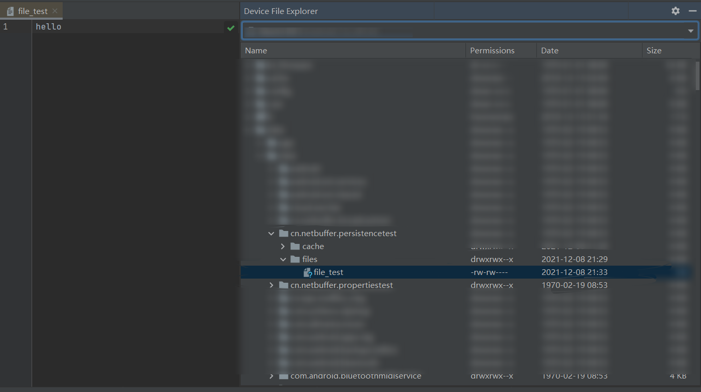
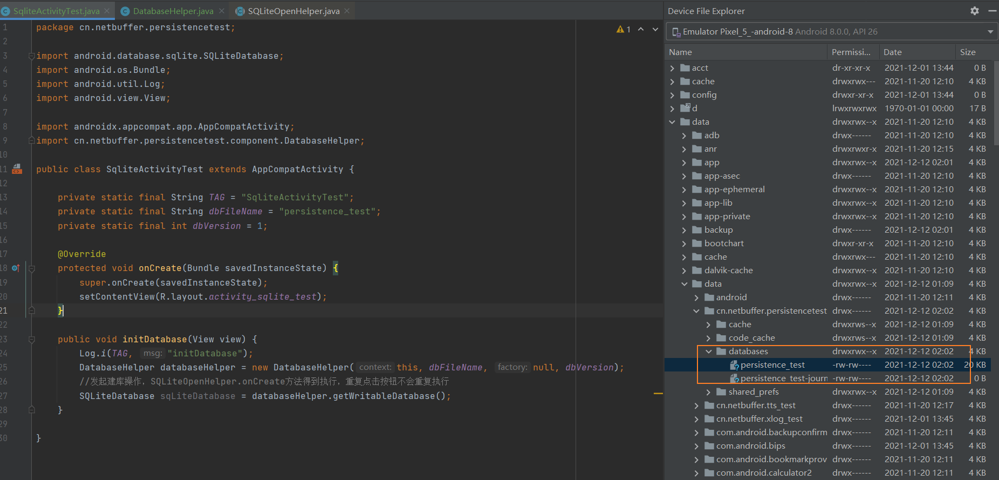
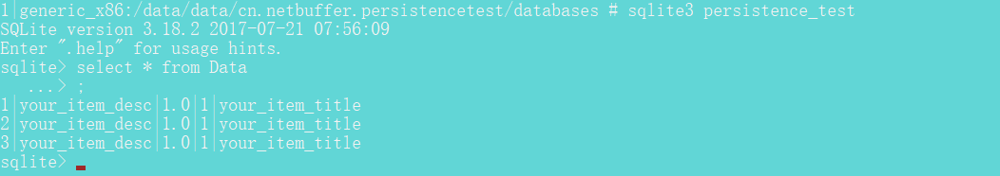

# PersistenceTest
* android持久化存储相关技术测试

### openFileOutput/openFileInput

### sqlite数据库操作

#### 文件位置

#### 查询

#### 更新数据库
> 通过修改SQLiteOpenHelper的构造函数version字段来设置数据库版本号，每次更新此版本号可实现数据库的升级
* 当修改数据库的版本号后，其它引用数据库的地方都要相应更新版本号，不能再使用之前的数据库版本号，否则会报错：Can't downgrade database from version 2 to 1